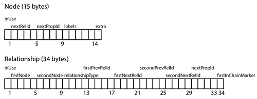

Unterschiede der beiden Datenbanktypen
======================================

Die Unterschiede können leichter erläutert werden, wenn zuvor die Ähnlichkeiten
und ihr Ableitung aus dem ER-Modell erläutert werden.

ER-Modell
---------

<<<<<<< HEAD

=======

>>>>>>> upstream/master

Abbildung 1: Einfaches ER-Modell

Die Grundlage bei der Erstellung der beiden Datenbankenarten – der relationalen
Datenbank und der Graph Datenbank – ist meist ein ER-Modell (Entity Relationship
Modell). Ein ER-Modell kann aufgefasst werden als eine Abbildung eines Teiles
der Realwelt, bestehend aus Gegenständen und Beziehungen. Ein Beispiel für ein
einfaches ER-Modell mit den Gegenständen (Entitäten) *Studenten* und *Vorlesung*
und der Beziehung (Relation) *besuchen* ist in Abbildung 1 zu sehen.

Speicherung
-----------

Bei relationalen Datenbanken werden aus dem Modell nun Gegenstände in Tabellen
umgewandelt. Relationen werden teilweise diesen Tabellen hinzugefügt oder in
separate Tabellen, sogenannte Indexe oder Relationstabellen, gespeichert.

<<<<<<< HEAD

=======

>>>>>>> upstream/master

Abbildung 2: Durch globale Indexe realisierte Relationen

Die algorithmische Komplexität der Abfrage über einen Index (wie in Abbildung 2
gezeigt) ist, je nach Implementierung *O log n* groß, n sei
dabei die Anzahl der Zeilen in der Indextabelle. Die gleiche Abfrage in einer
Datenbank ohne Indexe aber mit direkten Relationen, wie in Abbildung 3 zu sehen,
besitzt eine Komplexität von *O(1)*. Der Durchlauf durch *m* Schritte
„kostet“ dann *O(m log(n))* für die Indexvariante im Gegensatz zu
*O(m)* mit Relationen.[2]

<<<<<<< HEAD

=======

>>>>>>> upstream/master

Abbildung 3: Speicherung der Relationen ohne Verwendung eines Indexes

Am Beispiel der Graph Datenbank Neo4j werden der Informationen in
unterschiedlichen Speichern (engl. *store files*) abgelegt. Es gibt separate
Speicherplätze und physikalische Dateien für Knoten, Relationen, Labels und
Eigenschaften (z.B. *neostore.nodestore.db* für die Speicherung der Knoten).[3]
Alle Einträge eines Stores besitzen die gleiche Länge, wodurch die ID des
Eintrags nicht abgespeichert werden muss, sondern aus der Position des ersten
Bytes im Store ersichtlich ist. Die Stores werden daher auch als *fixed-size
record stores* bezeichnet (dt.: Speicher mit Einträgen festgelegter Größe) und
sind wesentlich performanter (mit *O(1)* i.G.z. zu *O(log(n))* bei einer
Suche).

<<<<<<< HEAD

=======

>>>>>>> upstream/master

Abbildung 4: Struktur für Einträge in den Knoten- und Relationenspeicher[4]

In Neo4j der Version 2.2 besitzen Knoteneinträge eine Länge von 15 Byte (vgl.
Abbildung 4). Somit beginnt der Eintrag der ID 20 bei Byte 300. In einem Knoten
werden sein Aktivstatus und die IDs zur nächsten Relation, zur nächsten
Eigenschaft und zu Labels abgespeichert.

Unterschieden werden die Eintragsarten in *singly linked lists* und *doubly
linked lists*. In Abbildung 5 sind Beispiele für beide Arten zu erkennen.
*Singly linked lists* sind Listen, die singulär verlinken, also lediglich auf
die nächste ID verweisen. Knoteneinträge (*Node records*) sind ein Beispiel
dafür, so verlinkt *Node1* singulär zur Eigenschaft *name*, die als Key-Value
Paar im Property Store abgespeichert wird. Das zweite Key-Value Paar wird nicht
direkt vom Knoten verlinkt, sondern vom ersten Key-Value Paar.

<<<<<<< HEAD

=======

>>>>>>> upstream/master

Abbildung 5: Physikalische Speicherung eines Graphs in Neo4j[5]

*Doubly linked lists* verknüpfen zwei gleichartige IDs, wie in der Abbildung
beispielhaft dargestellt. Hier verknüpft *Likes* die Knoten *Node1* und *Node2*
als Start- bzw. Endknoten*.* Zusätzlich wird auf den vorigen und nächsten
Eintrag der jeweiligen Knoten verwiesen.

Abfragen
--------

Die für relationale Datenbanken verwendete Abfragesprache Structured Query
Language, kurz SQL, ist standardisiert und für unterschiedliche relationale
Datenbank in ähnlichem Maße implementiert. Für die Graph Datenbank Neo4j wird
vom Hersteller die Abfragesprache Cypher empfohlen, mit dem Hinweis, dass diese
den Konzepten von SQL nachempfunden wurde und durch zusätzliche Funktionalitäten
zu einfachen und präzisen Anfragen führen soll.[6]

Eine einfache SQL Abfrage um Daten aus einer Datenbank auszulesen sieht
folgendermaßen aus:[7]

~~~roomsql
SELECT *
FROM Studenten
WHERE Semester < 10
~~~

Die gleiche Abfrage in einem Cypher Statement kann wie folgt aussehen:[8]

~~~roomsql
MATCH (s:STUDENTEN)
WHERE s.Semester < 10
RETURN s
~~~

Wenn Informationen aus verschiedene Quellen verknüpft werden müssen, um eine
Ergebnis für eine Anfrage zu erhalten, werden in SQL Statements *JOINS*
verwendet. Im Gegensatz erfolgt die Abfrage nach einer solchen Beziehung in
Cypher durch eine eigene Schreibweise.[9]

SQL-Abfrage nach dem Namen aller Personen die im „IT-Department“ arbeiten:

~~~roomsql
SELECT name
FROM Person
LEFT JOIN Person_Department ON Person.Id = Person_Department.PersonId
LEFT JOIN Department ON Department.Id = Person_Department.DepartmentId
WHERE Department.name = 'IT Department'
~~~

Die entsprechende Abfrage mit Cypher für eine Neo4j Datenbank:

~~~roomsql
MATCH (p:Person)<-[:EMPLOYEE]-(d:Department)
WHERE d.name = "IT Department"
RETURN p.name
~~~

##### Quellen

\[2]: Robinson et al. (2015, S. 149ff.)

\[3]: Robinson et al. (2015, S. 153ff.)

\[4]: Robinson et al. (2015, S. 153ff.)

\[5]: Robinson et al. (2015, S. 155ff.)

\[6]: neo4j (2017a)

\[7]: Goldstein (2005)

\[8]: neo4j (2017b, S.1)

\[9]: neo4j (2017a)

##### Navigation

| [Deckblatt](00_title.md) |
[Inhalt](00_toc.md) |
[Einleitung](01_introduction.md) |
[Unterschiede der beiden Datenbanktypen](02_db_differences.md) |
[Anwendungsfälle für Graph Datenbanken](03_graphdb_usecases.md) |
[Datengrundlage Social Media](04_data_basis.md) |
[Herangehensweise](05_method.md) |
[Ergebnisse](06_results.md) |
[Fazit](07_conclusion.md) |
[Literaturverzeichnis](08_references.md) |
[Anhang](09_appendix.md) |