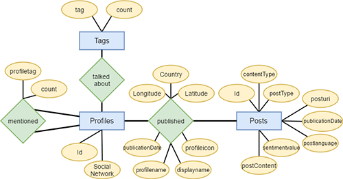
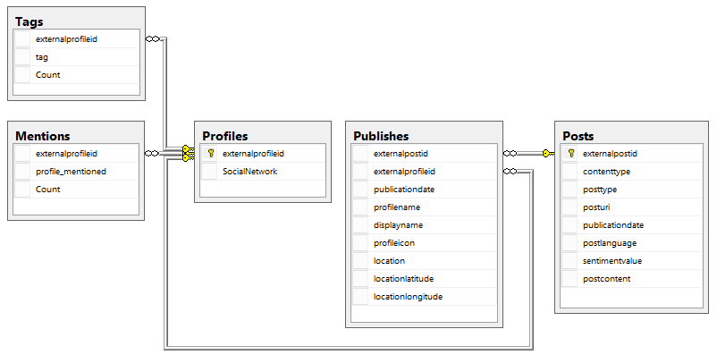

Datengrundlage Social Data
==========================

Als Datengrundlage wird ein Datensatz verwendet, der innerhalb des
Forschungsprojekts *TAXOPublish* an der *Hochschule der Medien* mithilfe des
Microsoft Tools *Social Engagement* und eines Datenflusses dieser Daten in eine
lokale SQL Datenbank entstanden ist. Durch die Verwendung des Tools von
Microsoft konnten innerhalb von 2 Jahren ein Datensatz zum Thema
Elektrowerkzeuge in der Größenordnung von \~200.000 Beiträgen aus Sozialen
Netzwerken, Blogs und Foren gesammelt werden.

Die Beiträge wurden als JSON versendet und als Einzeiler in eine Tabelle
abgelegt. Die Tabelle besteht somit aus 200.000 Zeilen. Es wurden zu jedem
Beitrag eine Vielzahl an Metadaten abgespeichert. Dazu gehören unter anderem der
Profilname des Autors, der Zeitpunkt der Erstellung, die Url zum Beitrag und
Autor, teilweise die Geodaten und der Beitrag als Text. Der Text wurde
aufbereitet und von Whitespace und HTML-Elementen entfernt, aus dem Text wurden
zusätzlich die genannten Tags der Form \#hashtag und angesprochene Personen der
Form \@profile herausgezogen.

Die Daten ist somit sehr flach abgespeichert, wodurch eine Umwandlung in eine
CSV Datei auf einfache Weise erfolgen konnte. Hier eine Auflistung aller 28
Spalten:

~~~roomsql
[postid], [externalpostid], [contenttype], [posttype], [posturi],
[publicationdate], [externalprofileid], [profilename], [displayname],
[profileicon], [location], [locationlatitude], [locationlongitude],
[locationquadkey], [sourceparam], [postlanguage], [normalscore], [provider],
[providerscore], [sentimentvalue], [refpost_profilename], [refpost_profileid],
[refpost_profileicon], [refpost_profiledisplayname], [refpost_externalid],
[cleanpostcontent], [contained_tags] , [contained_profiles]
~~~

Optimierung der Datengrundlage
------------------------------

Die Datengrundlage wurde zur besseren Verarbeitung auf \~166.000 Beiträge
verkleinert. Es sind durch die Verkleinerung lediglich die Beiträge aus den
Sozialen Netzwerken Twitter, Facebook und Instagram übernommen worden, da
Blogbeiträge oft Längen von mehr als 4000 Zeichen aufwiesen und somit nicht in
vollem Maße durch SQL Funktionen verarbeitet werden konnten (z.B. WhiteSpace-
und HTML Entfernung). \~45.000 Beiträge nennen dabei mindestens ein anderes
Profil, \~100.000 Beiträge nennen mindestens einen Hashtag.

Die Erstellung der CSV Datei erfolgte mithilfe des Exporttasks in ein Flatfile,
welches Unicode codiert und Tabulator-getrennt abgespeichert wurde. Im Anschluss
wurde, um spätere Probleme zu vermeiden, alle doppelten Anführungsstriche (")
mithilfe der Suchen/Ersetzen Funktion eines Texteditors gelöscht.

Speicherung in der jeweiligen DB
--------------------------------

Als Grundlage der beiden zu erstellenden Datenbanken wurde das folgende
ER-Modell erstellt:

<<<<<<< HEAD

=======

>>>>>>> upstream/master

Abbildung 6: ER-Modell der zu importierenden Daten

Für das weitere Vorgehen wird, so gut wie es möglich ist, dieses Modell als
Vorlage verwendet.

### Relationale DB

Die Speicherung in der relationalen DB erfolgte im Forschungsprojekt
nicht-normalisiert. Jeder soziale Beitrag wurde in einer eigenen Zeile mit
jeglichen Metadaten, auch des Profils abgespeichert. Für eine bessere
Vergleichbarkeit der relationalen Datenbank und der Graph Datenbank wurde für
die Hausarbeit die Form der Einzeltabelle aufgebrochen.

<<<<<<< HEAD

=======

>>>>>>> upstream/master

Abbildung 7: Tabellen der relationalen Datenbank

Es entstanden dabei die fünf Tabellen: *Posts*, *Profiles*, *Publishes*, *Tags*
& *Mentions*. Die Relation *talks*\_*about* und die Entität *Tags* wurden in
einer Tabelle zusammengefasst. Zudem wurden die Tabellen *Profiles* und *Posts*
mit Primärschlüsseln versehen, um den Fremdschlüsseln der Relationstabellen
*Publishes*, *Tags* und *Mentions* Verbindung zu den Entitätstabellen zu
gewähren. In der SQL Datenbank eingefügt sieht das Konstrukt wie in Abbildung 7
dargestellt aus. Das Schema der Datenbank gibt das Entity-Relationship Modell
auf sehr ähnliche Weise wieder.

### Graph Datenbank

In der Graph Datenbank kann das ER-Modell noch genauer nach der Vorlage erstellt
werden, da in Graph Datenbanken jeweils ein Konstrukt für Entitäten und
Relationen zur Verfügung steht – in relationalen Datenbanken existiert lediglich
das Konstrukt *Tabelle*. Somit entstanden die drei Entitäten *Profile*, *Post*
und *Tag* und die drei Relationen *Published*, *Talks_about* und *Mentioned*.

<<<<<<< HEAD

=======

>>>>>>> upstream/master

Abbildung 8: Entitäten und Relationen in der Graph Datenbank

In Abbildung 8 ist das Schema der erstellten Graph Datenbank dargestellt. Die
Eigenschaften der Entitäten und Relationen gleichen den Eigenschaften des
ER-Modells (nicht in der Abbildung zu sehen). Wie in NoSQL-Datenbanken üblich
werden allerdings keine Eigenschaften gespeichert, die keinen Inhalt haben,
i.G.z. relationalen Datenbanken, deren leere Eigenschaften mit NULL aufgefüllt
werden.

Des Weiteren wurden die Indexe *Posts(PostId), Posts(ProfileMentioned),
Profile(ProfileId)* für eine bessere Importperformance und der Unique Constraint
*Tag(Tag)* für die Prüfung auf Einzigartigkeit erstellt.

### Speicherplatzbedarf

Der benötigte Speicherplatz der Graph Datenbank in Neo4J beträgt mit insgesamt
2,86 GB ungefähr doppelt so viel wie der Speicherplatz, der in der relationalen
Datenbank SQL Server mit 1,4 GB für den Datensatz benötigt wird.

##### Navigation

| [Deckblatt](00_title.md) |
[Inhalt](00_toc.md) |
[Einleitung](01_introduction.md) |
[Unterschiede der beiden Datenbanktypen](02_db_differences.md) |
[Anwendungsfälle für Graph Datenbanken](03_graphdb_usecases.md) |
[Datengrundlage Social Media](04_data_basis.md) |
[Herangehensweise](05_method.md) |
[Ergebnisse](06_results.md) |
[Fazit](07_conclusion.md) |
[Literaturverzeichnis](08_references.md) |
[Anhang](09_appendix.md) |
