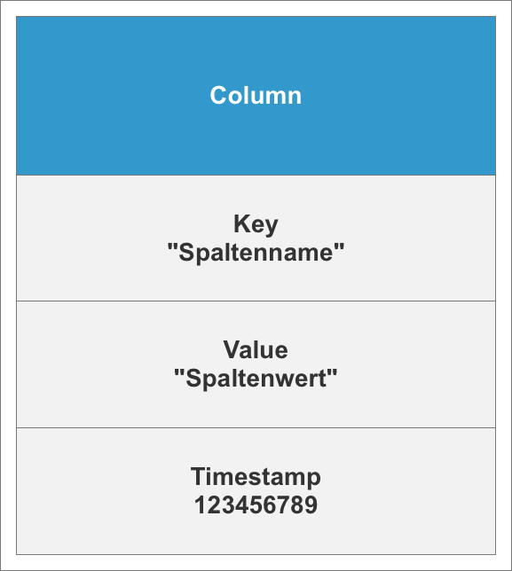

# 3 Spaltenorientierte Datenbanken

## Allgemeines
In der NoSQL-Welt sind verschiedene Datenbankmodelle zu finden. Eines dieser Modelle bilden die sogenannten „Wide-Column Stores. Den Namen verdankt das Modell der Anzahl von bis zu 2 Milliarden Spalten die ein Datensatz aufnehmen kann. Häufig wird dieses Modell im deutschen mit dem Begriff „spaltenorientierte Datenbank“ übersetzt. Diese Übersetzung ist jedoch nur bedingt richtig, da er eigentlich für die relationalen Datenbanksysteme verwendet wird. Daher wird im Laufe dieser Ausarbeitung nur der englische Begriff verwendet.

Das Datenmodell der „Wide Column Stores“ unterscheidet sich stark von den traditionellen, relationalen Datenbanken. Sie sind tabellenähnlich aufgebaut, stellen eine Art zweidimensionale Variante des Key-Value Konzeptes dar und basieren im Grunde auf das BigTable Modell von Google (Chang et. al., 2006). In beiden Modellen existieren die Begriffe Zeile (= Row) und Spalte (= Column). Trotz einer ähnlichen Bedeutung sind sie mit anderen Eigenschaften belegt. Eine Zeile wird mit Hilfe eines Schlüssels identifiziert. Aus diesem Grund ist es möglich, dass mehrere Zeilen eine unterschiedliche Anzahl von Spalten besitzen können. Aufgrund dieser Eigenschaft, eignet sich das Modell besonders für analytische Aufgaben. Die Daten bei diesem Modell werden über Schlüssel gespeichert, die mit Werten verknüpft sind. Eine Spalte bildet dabei die kleine Einheit. Sie besteht immer aus einem Key-Value Paar, sprich einen Namen der mit einem Wert verknüpft ist sowie aus einem Zeitstempel, welcher rein der Versionsverwaltung dient. Man spricht hierbei von einer Spaltenstruktur und ist in Abbildung 1 grafisch dargestellt.

*Abbildung 1: Spaltenstruktur, eigene Darstellung
