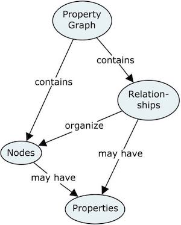
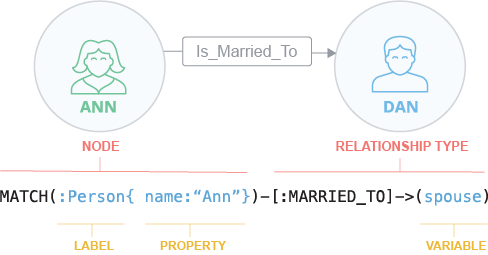
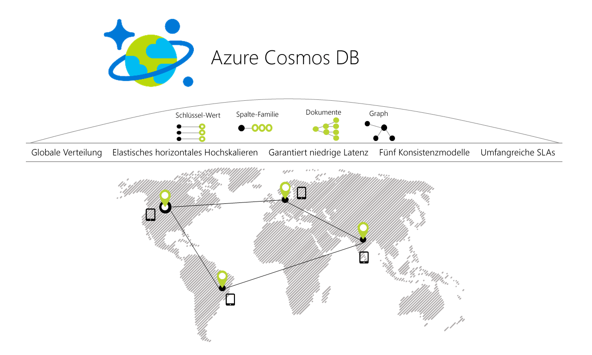

# 5 Graphenbasierte Datenbanken

Die mathematische Theorie zu Graphen ist weitaus älter als die Entwicklung der graphenbasierten Datenbanken (Hunger, S.3). Bereits 1736 befasste sich Leonard Euler unwissentlich bei der Lösung des berühmten Königsberger Brückenproblems mit der Graphentheorie (Nitzsche, S.19). Er entwickelte die Theorie, "als er einen Weg über die sieben Brücken des damaligen Königsbergs finden wollte, ohne eine doppelt überqueren zu müssen" (Hunger, S.3).

Dabei "zeichnete er zwischen den Stadtteilen die Spazierwege über die Brücken als gerade oder gebogene Kanten und ließ die Feinheiten des Stadtplans weg" (siehe Abbildung 1). Daraus entstand die Form, die wir heute als Graphen bezeichnen. (Nitzsche, S.19)

*Abbildung 1: Königsberger Brückenproblem von L. Euler*
[(Quelle: springer.com)] (https://link.springer.com/chapter/10.1007/978-3-8348-9968-2_2)

Auf die Graphentheorie kann aufgrund des Umfanges dieser Arbeit nicht näher eingegangen werden, aber sie dient als Grundlage für die weitere Vorstellung der graphenbasierten Datenbanken, da diese auf dieses Datenmodell zurückgreifen.

Der genaue Startpunkt der Entwicklung der Graphdatenbanken wird in der Fachwelt unterschiedlich eingeschätzt. Einige Experten behaupten, dass das Netzwerk-Datenmodell [1], welches von IBM in ihren Systemen in den 1970er Jahren verwendet wurde, dem Graph-Datenmodell sehr ähnelt. Allerdings gab es für das Netzwerk-Datenmodell damals keine deklarative Abfragesprache und daher lassen sich die beiden Modelle nicht oder nur sehr schlecht miteinander vergleichen. Entwickler mussten früher die genaue physische Speicherung der Daten kennen, um Programme für die Abfrage der Daten schreiben zu können. (Bitnine)

In den 1980er Jahren etablierte sich das relationale Datenbankmodell. Diese Entwicklung war schon ein erheblicher Fortschritt und stellte ein gewisses Level der Datenunabhängigkeit dar, da Informationen ohne das Wissen der genauen physischen Struktur der Datenbank abgerufen werden konnten. Nach einigen Jahren, wurde die Abfragesprache SQL (Structured Query Language) von IBM entwickelt und blieb bis heute durch viele iterative Weiterentwicklungen die Standard Abfragesprache für relationale Datenbanken. (Bitnine)

Erst in den 1990er Jahren wurden vom W3C verschiedene Vorschläge zu Webdatenstandards, wie XML und RDF, gemacht. Diese Entwicklung kann man als eigentlichen Startpunkt der Graphdatenbanken sehen, da diese Datenmodelle bereits in ihrer Basis das Graph-Datenmodell beinhalten. Ab 1998 startete die NoSQL-Welle und bis heute wurden unzählige NoSQL-Datenbanken veröffentlicht. Im Jahre 2000 wurde dann Neo Technologies gegründet und die Entwicklung von ihrer Graphdatenbank Neo4j begann. Seitdem wurden zahlreiche kommerzielle und frei verfügbare Graphdatenbanken entwickelt. Seit 2010 setzen sich auch zunehmend Multi-Modell Datenbanken durch. (Bitnine)

Graphenbasierte Datenbanken sind Teil der NoSQL-Bewegung und vereinen die Eigenschaften Transaktionalität und ACID (atomicity, consistency, isolation und durability). Mit diesem Datenbankentyp ist das Management von komplexen, vernetzten Daten (Graphstrukturen) möglich und größtenteils sind sie quelloffen sowie entwicklerorientiert. Zudem sind sie vor allem "dafür prädestiniert, relevante Informationsnetzwerke transaktional zu speichern und besonders schnell und effizient abzufragen. Das Datenmodell besteht aus Knoten, die mittels gerichteter, getypter Verbindungen miteinander verknüpft sind. Beide können beliebige Mengen von Attribut-Wert-Paaren (Properties) enthalten. Daher wird dieses Modell auch als 'Property-Graph' bezeichnet" (siehe Abbildung 2). (Hunger, S.3-4)

Um eine "hochperformante Navigation [innerhalb des] Graphen" zu ermöglichen, "werden die Verbindungen beim Einfügen in die Datenbank als persistente Strukturen abgelegt." Zwar entsteht dadurch ein Zusatzaufwand beim Speichern, aber beim Abfragen der Informationen, welches viel häufiger geschieht, "können die direkt gespeicherten Verknüpfungsinformationen zur schnellen Navigation in konstanter Zeit genutzt werden". (Hunger, S.4-5)

*Abbildung 2: Struktur "Property-Graph"*
[(Quelle: graphdatamodeling.com)](http://graphdatamodeling.com/Graph%20Data%20Modeling/GraphDataModeling/page/files/stacks-image-3066b52-288x358@2x.jpg)

Die Auswahl der Kandidaten bei der anschließenden Vorstellung erfolgte aufgrund der Beliebtheit im Januar 2018 auf der Website DB-Engines [2] in der Kategorie Graphdatenbanken. Demzufolge ist Neo4j auf Platz 1, Microsoft Azure Cosmos DB (Multi-Model) auf Platz 2 und OrientDB (Multi-Model) auf Platz 3. Aufgrund des Umfanges dieser Hausarbeit konnte nur auf die ersten drei Platzierungen eingegangen werden.

## Neo4j

Neo4j ist eine Graphdatenbank, die ihre Daten ebenfalls in Knoten und Kanten (Beziehungen) speichert. 2010 wurde die Version 1.0, nach 10 Jahren Entwicklungsarbeit, von Neo Technology, einem Startup-Unternehmen mit Sitz in Malmö und San Francisco, veröffentlicht (Neo4j Inc., 2010). 

Sie gilt "als einer der ältesten Vertreter [in] der Kategorie der Graphdatenbanken" und wurde "ursprünglich für die Echtzeitsuche von verschlagworteten Dokumenten über Sprachgrenzen (27 Sprachen) und Bedeutungshierarchien hinweg als Teil eines Onlinedokumentenmanagementsystems entwickelt" (Hunger, S.9). Zudem gehört Neo4j zu den nativen Graphdatenbanken. "Nativ bedeutet, dass Knoten und Beziehungen direkt in den internen Datenbankstrukturen als Records in den Datenbankdateien repräsentiert sind. Neo4j nutzt keine andere Datenbank als Persistenzmechanismus, sondern baut auf einer eigenen Infrastruktur auf, die speziell dafür entwickelt wurde, vernetzte Daten effizient zu speichern" (Hunger, S.4).

Die Datenbank ist in Java implementiert und wird als Open-Source-Projekt angeboten. Laut der Entwickler wird Neo4j als eingebettete, Disk-basierte, transaktionale Datenbank-Enginge, die Daten anstatt in Tabellen in Graphen strukturiert speichert, beschrieben. Ein Graph ist eine flexible Datenstruktur, die eine agile und schnellere Entwicklung erlaubt. (Terrill)

### Datenstruktur

Das "Labeled Property Graph Model" (Neo4j Inc., 2018, Product Basics) von Neo4j besteht aus Knoten (Node), Beschriftungen (Label), Beziehungen (Relationships) und Eigenschaften (Properties) (siehe Abbildung 3).

Die Knoten stellen die Hauptelemente dar. Wie hier im Beispiel "Ann" und "Dan". Sie sind untereinander durch Beziehungen verbunden. Zusätzlich können sie eine oder mehrere Eigenschaften besitzen. Entweder als einzelnes Attribut oder Key-Value-Paare. Außerdem besitzen Knoten Beschriftungen, um ihre Rolle im Graph zu beschreiben. (Neo4j Inc., 2018, Product Basics)

Beziehungen verbinden in der Regel zwei Knoten miteinander und sind direktional. Knoten können aber auch mehrere oder rekursive Beziehungen besitzen. Zusätzlich können Beziehungen auch mehrere Eigenschaften besitzen. (Neo4j Inc., 2018, Product Basics)

Eigenschaften werden als string abgebildet. Wenn sie einen Key besitzen, wird dieser auch als string gespeichert. Eigenschaften können sowohl über den Index als auch über den Key angesprochen werden. Kombinierte Indizes können von mehreren Eigenschaften geschaffen werden. (Neo4j Inc., 2018, Product Basics)

Durch Beschriftungen können Knoten in Gruppen eingeteilt werden. Ein Knoten kann dabei auch mehrere Beschriftungen besitzen. Beschriftungen sind dabei auch indexiert, um die Suche nach Knoten im Graph zu beschleunigen. Native Indizes sind im Hinblick auf Geschwindigkeit optimiert. (Neo4j Inc., 2018, Product Basics)

*Abbildung 3: Datenstruktur von Neo4j*
[(Quelle: neo4j.com)](https://s3.amazonaws.com/dev.assets.neo4j.com/wp-content/uploads/20170731095054/Property-Graph-Concepts-Simple.svg)

### Abfragesprache

Die Firma Neo4j Inc. entwickelte zusätzlich die deklarative Graphdatenbankabfragesprache Cypher für die Neo4j Graph Datenbank. Sie ist aber darüber hinaus für alle Graphdatenbanken anwendbar und wurde aus diesem Zweck im Jahr 2016 zu einem Open Source Projekt von der Neo4j Inc. erklärt. Sie soll laut Hersteller die beliebteste Abfragesprache für Graphdatenbanken sein und als Standard-Sprache ("SQL for graphs") weiterhin ausgebaut werden. (Neo4j Inc., 2018, Cypher)

Cypher ist eine Abfragesprache, die für alle Graphdatenbanken geeignet ist und zeichnet sich durch eine einfach ASCII-artige Syntax aus. Diese Syntax ermöglicht die Bildung vielfältiger, gut lesbarer "Match Patterns" für Knoten und Kanten (siehe Abbildung 4). (Neo4j Inc., 2018, Cypher)

Wie in Abbildung 4 erkennbar, werden die "Knoten als geklammerte Bezeichner und Beziehungen als Pfeile aus Bindestrichen (ggf. mit Zusatzinformationen wie Richtung oder Typ)" dargestellt. "Attribute werden in einer JSON-ähnlichen Syntax in geschweiften Klammern" abgebildet. (Hunger, S.6)

*Abbildung 4: Beispiel von Abfragesprache Cypher*
[(Quelle: neo4j.com)](https://s3.amazonaws.com/dev.assets.neo4j.com/wp-content/uploads/20170731135122/Property-Graph-Cypher.svg)

Zusätzlich ist Cypher eine deklarative Abfragesprache, die dem Nutzer, ähnlich wie bei SQL, eine einfache Verwendung von verschiedenen Aktionen (match, insert, update oder delete) erlaubt. (Neo4j Inc., 2018, Cypher)

Laut Hunger (S.6-7) "ist Cypher [sogar] viel mächtiger als SQL, wenn es um die Darstellung komplexer Beziehungen, Pfade oder Graphalgorithmen geht." Zudem sei "die [...] Arbeit mit Listen (filter, extract, reduce, Quantoren), das Verketten von mehreren Teilabfragen und die Weiterleitung von (Teil-) Ergebnissen bzw. Projektionen an nachfolgende Abfragen" sehr viel angenehmer. Neben der einfachen Darstellung und schnellen Ausführung von komplexen Anfragen, kann Cypher auch "Daten und Strukturen im Graphen erzeugen, modifizieren und korrigieren".

### Vorteile zu anderen NoSQL Datenbanken

Laut Neo4j Inc. (2018, Product Comparison) biete die Neo4j Datenbank folgende Vorteile gegenüber anderen NoSQL Datenbanken:

* **Datenspeicher:** Native Graphenspeicherstruktur mit Index-freier Verknüpfung führt zu schnelleren Transaktionen und Verarbeitung der Datenbeziehungen.
* **Datenmodellierung:** Flexibles, „Whiteboard-friendly“ Datenmodell ermöglicht eine feinkörnige Steuerung der Datenarchitektur. Das intuitive Datenmodell erleichtert die Kommunikation zwischen Entwicklern, Architekten und Datenbankadministratoren.
* **Abfrageleistung:** Native Graph Verarbeitung verursacht keine Latenz und sorgt, unabhängig von der Anzahl und Tiefe der Beziehungen, für Echtzeit-Performance.
* **Abfragesprache:** Cypher - Eine native Graphdatenbankabfragesprache, die die effizienteste und expressivste Art darstellt, um Beziehungen abzufragen.
* **Transaktionsunterstützung:** ACID-Transaktionen gewährleisten vollständig konsistente und zuverlässige Daten rund um die Uhr - perfekt für always-on globale Unternehmensanwendungen.
* **Verarbeitung nach Maß:** Natives Graph Modell skaliert von Natur aus für musterbasierte Abfragen. Scale-Out-Architektur hält die Datenintegrität über der Replikation. Massive Scale-up Möglichkeiten mit IBM POWER8 und CAPI-Flash-Systemen.
* **Effizienz im Rechenzentrum:** Daten und Beziehungen werden nativ zusammen mit einer Verbesserung der Leistung gespeichert, wenn Komplexität und Umfang wachsen. Dies führt zu einer Server-Konsolidierung und einer unglaublich effizienten Nutzung der Hardware.

## Microsoft Azure Cosmos DB

Microsoft stellte ihre weltweit verfügbare Datenbank-Lösung am 10.05.2017 erstmals auf der Microsoft-Entwicklerkonferenz "Build 2017" vor. "Als 'Datenbank der Zukunft', die noch viele Jahrzehnte Bestand haben soll, bezeichnet Microsoft-Manager Dharma Shukla die neue Azure Cosmos DB gegenüber dem Tech-Portal Techcrunch". Microsoft begann die Entwicklung bereits 2010 und baut auf den NoSQL-DocumentDB-Service auf. Mit der Entwicklung der Azure-Cosmos-Datenbank sollte zuerst den "hauseigenen Entwicklern die Arbeit mit weltweit verfügbaren Applikationen" erleichtert werden. Zukünftig soll sie, wie auch DocumentDB, "weltweit verfügbare Cloud-Services und Applikationen abbilden". (Brien)

"Azure Cosmos DB unterstützt verschiedene Datentypen sowie eine Reihe von APIs um auf Daten etwa von MongoDB, DocumentDB SQL, Gremlin und Azure Tables zugreifen zu können. Als eines der ersten kommerziellen Datenbankangebote setzt Cosmos DB laut Microsoft auf die Möglichkeit für die Nutzer, zwischen verschiedenen Konsistenzmodellen zu wählen." Zur Zeit ist sie in 34 Azure-Regionen (global verteilte Rechenzentren für Microsofts Cloud-Computing-Plattform) verfügbar und kostet beispielweise in der Region Germany Central 30 US-Dollar pro Monat. (Brien)

Laut Microsoft (Introduction) ist die Azure Cosmos DB eine global verteilte Datenbank mit mehreren Modellen. Der Datenbank-Dienst soll verschiedene Datenmodelle unterstützen: Dokumente, Schlüsselwerte, Graphen und spaltenorientierte Datenmodelle (siehe Abbildung 5). Neben dem Datenmodell könne der Nutzer auch "Durchsatz und Speicher elastisch und unabhängig voneinander über eine beliebige Anzahl von geografischen Azure-Regionen hinweg skalieren". Auch die Indexierung der Daten übernehme die Datenbank voll automatisch, sodass sich der Nutzer nicht mit der Schema- und Indexverwaltung befassen muss. Aufgrund des begrenzten Umfanges dieser Arbeit kann an dieser Stelle nur tiefer auf die Graphdatenbank von Azure Cosmos DB eingegangen werden.

*Abbildung 5: Azure Cosmos DB*
[(Quelle: microsoft.com)](https://docs.microsoft.com/de-de/azure/cosmos-db/media/introduction/azure-cosmos-db.png)

### Datenstruktur

Die Azure Cosmos Graphdatenbank benutzt wie Neo4j auch das Property-Graph-Modell. Allerdings bezeichnet Microsoft in ihrer Produktbeschreibung Knoten als Vertices und Kanten als Edges. Vertices stellen im Graphen "diskrete Objekte" wie zum Beispiel eine Person, einen Ort oder ein Ereignis dar. Durch die Edges werden die Beziehungen untereinander deutlich. Sowohl Vertices als auch Edges können eine beliebige Anzahl von Eigenschaften aufweisen. Diese Eigenschaften geben zusätzliche Informationen zu Vertices (z.B. Alter und Name) und Edges (z.B. Zeitstempel und Gewichtung) an. (Microsoft, Graph Introduction)

### Abfragesprache

Zur Abfrage der Azure Cosmos DB kann die Apache TinkerPop-Graph-Traversalsprache Gremlin oder andere mit TinkerPop kompatible Diagrammsysteme wie Apache Spark GraphX verwendet werden. (Microsoft, Graph Introduction)

### Vorteile zu anderen NoSQL Datenbanken

Nach Meinung von Microsoft (Graph Introduction) biete die Graph-API ihrer Datenbank folgende Vorteile:

* Graph-Modellierung
* Replikation in mehreren Regionen
* Traversal-APIs
* Schnelle Abfragen und Traversierungen mit der vertrauten Gremlin-Syntax
* Vollständige Verwaltung
* Globale, sofort einsatzbereite Verteilung
* Kompatibilität mit Apache TinkerPop
* Flexible Skalierung von Speicher und Durchsatz mit Leselatenzen von weniger als 10 ms und weniger als 15 ms beim 99. Perzentil
* Automatische Indizierung mit sofortiger Abfrageverfügbarkeit
* Einstellbare Konsistenzebenen
* Umfassende Service Level Agreements (SLA) – einschließlich einer SLA mit einer Verfügbarkeit von 99,99 Prozent für alle Konten mit einer einzelnen Region und für alle Konten mit mehreren Regionen und gelockerter Konsistenz sowie einer Leseverfügbarkeit von 99,999 Prozent für alle Datenbankkonten mit mehreren Regionen.

## OrientDB

OrientDB wurde 2010 von der Firma OrientDB Ltd., die heute zu dem kalifornischen Unternehmen CallidusCloud gehört, als Open-Source-Projekt veröffentlicht [3]. Sie ist in Java implementiert und weist wie Microsofts Azure Cosmos DB mehrere Modelle auf [3].

Bei der Multi-Model Datenbank wurden mehrere Konzepte der NoSQL-Bewegung umgesetzt und gemischt. Als Basis besitzt das Modell eine dokumentenorientierte Datenbank, die zusätzlich über Eigentschaften von Graphendatenbanken verfügt. "OrientDB stellt dem Benutzer zwei verschiedene APIs zur Verfügung um dokumentenorientierte beziehungsweise graphenorientierte Datenbanken umzusetzen. Die Graph-API arbeitet eine Ebene über der Document-API und ist somit die erste Wahl für Einsteiger, weil damit ca. 80% aller Anwendungsfälle abgedeckt werden. Die übrigen 20% erfordern die flexiblere, weniger komplexe und für Nebenläufigkeit optimierte Document-API. Beide APIs arbeiten mit weiteren Konzepten, die auf niedrigeren Ebenen liegen." (Schmeck, S.1-2)

### Datenstruktur

"Die Graph-API von OrientDB setzt das Konzept der Graphdatenbanken um." Knoten werden, wie bei Microsofts Azure Cosmos DB, als Vertices oder ein Knoten als Vertex bezeichnet und "speichern Eigenschaften sowie ein- und ausgehende Kanten (Referenzen). Ein Vertex ist
dabei gleichzeitig ein Dokument mit variablem Schema, was noch einmal deutlich macht, dass die Graph-API eine Ebene über der Document-API arbeitet." Eine Kante wird auch als Edge bezeichnet und "ist eine bidirektionale Referenz zwischen zwei Vertices. Es wird dabei zwischen 'leightweight' und 'regular' Edges unterschieden. Eine 'regular Edge' wird im Gegensatz zur 'leightweight Edge' als Dokument gespeichert. Der Grundtyp in OrientDB ist ein Record,
das 'kleinste' Element das von der Datenbank verwaltet werden kann. Ein Record ist entweder ein Dokument, eine Edge oder ein Vertex. Beim Einfügen eines Records bekommt dieser eine eindeutige Record-ID, die vom System nicht neu vergeben wird. Eine Record-ID setzt sich aus der Cluster-ID und der Position des Records im Cluster zusammen." (Schmeck, S.3)

Zusätzlich kann OrientDB für Vertices und Edges einen Index anlegen. Ein Index ist ein Key-Value-Paar, wobei der Schlüssel über mehrere Eigenschaften der Objekte gebildet wird und der Wert die Record-ID ist. "Es gibt vier Indizierungs-Algorithmen von denen standardmäßig der SB-Baum, ein erweitertes B-Baum Modell, verwendet wird." (Schmeck, S.3)

### Abfragesprache

"SQL ist ein etablierter Standard für Abfragesprachen. Viele Entwickler sind damit vertraut und haben viel Erfahrung gesammelt. Deshalb verwendet OrientDB SQL als Abfragesprache und erweitert diese, um die Arbeit mit Graphen und Dokumenten zu ermöglichen. Die Abfragesprache von OrientDB entspricht bei simplen Abfragen dem SQL-Standard, weicht jedoch bei komplexeren Abfragen aufgrund der Strukturunterschiede zum Tabellenschema von diesem ab." (Schmeck, S.3)

### Vorteile zu anderen NoSQL Datenbanken

Laut des Unternehmens OrientDB Ltd. (OrientDB vs Neo4j) biete ihre Datenbank vor allem im Vergleich zu Neo4j folgende zusätzliche Features und Vorteile:

* Dokumentmodell und Dokumentfunktionen
* Objektmodell und objektorientierte Konzepte
* Sicherheit auf Rekordniveau
* Benutzer- und Rollensicherheit
* SQL
* Dynamische "Trigger"
* Benutzerdefinierte Datentypen
* Zusätzliche Einschränkungstypen
* Zusätzliche Indextypen und Indizes für mehrere Eigenschaften
* Reaktives Modell
* Verschiedene Schemata
* Sequenzen
* Funktionaler Grafikeditor
* Multi-Master-Replikation
* Sharding
* Elastische Skalierbarkeit ohne Konfiguration
* Serverseitige Funktionen
* Kommerzielle Lizenz
* Einbettbar ohne Einschränkungen

***

[1] http://www-lehre.inf.uos.de/~dbs/2001/skript/node21.html

[2] https://db-engines.com/en/ranking/graph+dbms

[3] https://db-engines.com/en/system/OrientDB